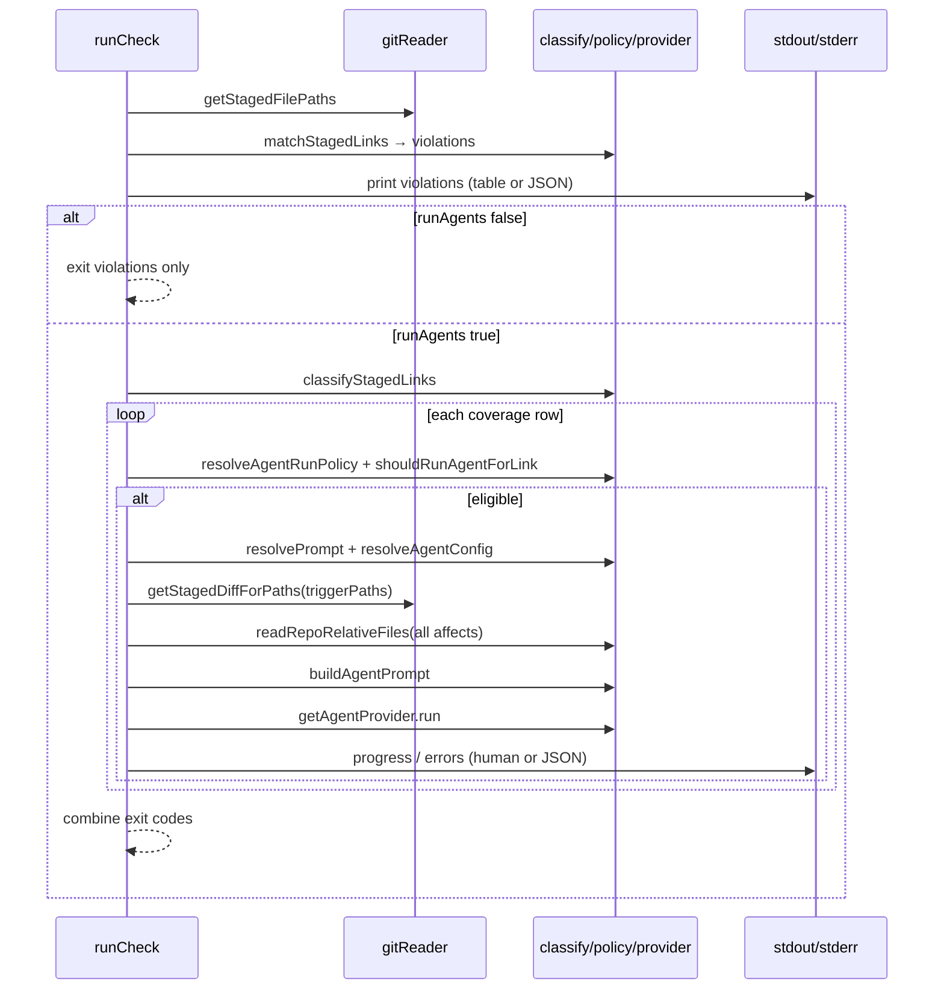

# Phase 7: CLI `check --run-agents` — Research

**Researched:** 2026-05-31  
**Domain:** CLI orchestration + core prompt/git context assembly atop existing agent policy and Cursor provider  
**Confidence:** HIGH (codebase and locked milestone decisions); MEDIUM for prompt/JSON/exit-code edge cases (no Phase 7 CONTEXT.md)

## Summary

Phase 7 wires the **opt-in** `filelinks check --run-agents` path: keep today’s **violation** flow (`matchStagedLinks` → stdout / JSON → exit on `severity: 'error'`), then for each link that passes **`classifyStagedLinks` + `resolveAgentRunPolicy` + `shouldRunAgentForLink`**, resolve prompt/agent config, build a **single string prompt** (CLI-07), and call **`getAgentProvider(id).run({ prompt, config })`**.

Critical integration rule from Phase 5 (**D-06**): eligibility uses **`classifyStagedLinks`**, not **`matchStagedLinks`**. Affect-only staging can run an agent with **zero violation rows** (`matchStagedLinks` returns `[]` while `shouldRunAgentForLink` is true). Missing companions must **not** block the agent run (milestone decision in `.planning/STATE.md` / CLI-06).

**Gaps today:** `runCheck` is sync and only knows violations; **`gitReader.ts`** has staged **path names** only (no diff content); there is **no** `buildAgentPrompt` (or similar) in core; Commander **`check`** has no `--run-agents`; README/CONTRIBUTING omit agent docs (DOC-03).

**Primary recommendation:** Add **core** helpers for staged diff + disk reads + prompt composition (unit-tested); make **`runCheck` async** when agents run; keep **E2E** to Commander wiring with mocked core (per `.cursor/rules/filelinks-cli-e2e.mdc`); run agents **sequentially** per eligible link.

<user_constraints>

## User Constraints (from milestone — no Phase 7 CONTEXT.md)

### Locked Decisions

- **Extend `check`, not a new command** — `filelinks check --run-agents` (`.planning/STATE.md`, CLI-05, out-of-scope table in REQUIREMENTS.md).
- **Explicit opt-in** — agents run only when `--run-agents` is passed (safety; REQUIREMENTS out-of-scope).
- **Run gate:** `trigger-or-affects` via `resolveAgentRunPolicy` + `shouldRunAgentForLink` (Phase 5; default when omitted).
- **Eligibility source:** `classifyStagedLinks` + policy gate — **not** `matchStagedLinks` rows (Phase 5 **D-06**).
- **Missing affects:** still invoke agent when policy allows (CLI-06, STATE.md, ROADMAP success criterion #2).
- **Provider:** `resolveAgentConfig` → `getAgentProvider(resolved.provider).run({ prompt, config })` — no `@cursor/sdk` in CLI (Phase 6 **D-04**).
- **Runtime:** explicit `local` (`cwd`) or `cloud` (`repos`); missing `CURSOR_API_KEY` → `AgentMissingApiKeyError` / `normalizeError` (Phase 6).
- **Prompt payload (CLI-07):** resolved `PromptConfig`, **trigger** staged diff, **affected file contents** from disk where paths exist.
- **Violation semantics unchanged:** `matchStagedLinks` + warn/error exit behavior preserved for check without agents (Phase 5 **D-01**).
- **Docs (DOC-03):** README + CONTRIBUTING — flag, agent config shape, `CURSOR_API_KEY`, local vs cloud.

### Claude's Discretion

- Exact prompt markdown/sections and ordering inside the final string.
- Whether `buildAgentPrompt` / git helpers live in `gitReader.ts` vs new `agentPrompt.ts` (must export from core barrel).
- JSON shape for `--json --run-agents` (extend `printCheckJson` vs separate printer).
- Exit code when agents fail but violations are warn-only (recommend: **1** if any agent error).
- `runCheck` vs thin `runCheckAgents.ts` split in CLI.
- Parallel vs sequential multi-link runs (recommend **sequential**).

### Deferred Ideas (OUT OF SCOPE)

- Standalone `filelinks suggest` (shipped as `check --run-agents` for v1.1).
- Auto-run without `--run-agents`.
- Non-Cursor providers (PROV-04).
- `@filelinks/git-hook` package wiring.
- VS Code / graph / Nx plugin.
  </user_constraints>

<phase_requirements>

## Phase Requirements

| ID     | Description                                                                                                  | Research Support                                                                                                                                                                                     |
| ------ | ------------------------------------------------------------------------------------------------------------ | ---------------------------------------------------------------------------------------------------------------------------------------------------------------------------------------------------- |
| CLI-05 | `filelinks check --run-agents` wired through Commander and `runCheck`                                        | Commander subcommand option on `check`; pass `runAgents: true` into `RunCheckOpts`; E2E asserts flag reaches runner (mock core). `runCheck` must become **async** (`provider.run` is async).         |
| CLI-06 | After violation reporting, eligible links invoke agent; **agents still run when affects missing from index** | Loop `classifyStagedLinks` × `shouldRunAgentForLink`; do **not** filter on `missingAffected.length`. Use `matchStagedLinks` only for violations.                                                     |
| CLI-07 | Prompt: `resolvePrompt`, trigger diff, affected contents from disk                                           | New core: `getStagedDiffForPaths(cwd, paths)`, `readRepoRelativeFiles(cwd, affects[])`, `buildAgentPrompt({ prompt, coverage, diff, files })`. Read **all** `entry.affects[].file`, not only staged. |
| DOC-03 | README / CONTRIBUTING document flag, agent config, `CURSOR_API_KEY`, local/cloud                             | Dedicated doc plan wave; example `defineLinks` block with `agent: { provider, runtime, model, local/cloud }`.                                                                                        |

</phase_requirements>

## Standard Stack

### Core

| Library                      | Version (verified)      | Purpose                       | Why Standard                                           |
| ---------------------------- | ----------------------- | ----------------------------- | ------------------------------------------------------ |
| `@filelinks/core` (existing) | workspace               | Policy, provider, config      | Phases 5–6 already export APIs                         |
| `node:child_process`         | Node 25+                | `git diff --cached`           | Same pattern as `getStagedFilePaths` in `gitReader.ts` |
| `node:fs`                    | Node 25+                | Read affect paths under `cwd` | No new file-read dependency                            |
| `@cursor/sdk`                | **1.0.17** (`npm view`) | Agent execution               | Already in core only via `cursorProvider.ts`           |

### CLI

| Library     | Version                                          | Purpose                   | Why Standard                |
| ----------- | ------------------------------------------------ | ------------------------- | --------------------------- |
| `commander` | **^13.1.0** (package.json; registry latest 15.x) | `--run-agents` on `check` | Existing CLI framework      |
| `vitest`    | ~4.1.0                                           | Unit + E2E                | Repo standard (`AGENTS.md`) |

### Supporting (unchanged)

| Concern    | Use                                                      |
| ---------- | -------------------------------------------------------- |
| Validation | Effect Schema — no Zod for same shapes                   |
| Errors     | `normalizeError` at CLI boundary                         |
| Tests      | `*.spec.ts` beside sources; `[e2e]` in `cli.e2e.spec.ts` |

**Installation:** No new runtime deps expected for Phase 7 (git/fs only).

## Architecture Patterns

### Recommended flow (`runCheck`)



### Module placement

| Layer                                                            | Responsibility                                                    |
| ---------------------------------------------------------------- | ----------------------------------------------------------------- |
| `packages/core/src/lib/gitReader.ts` (extend)                    | `getStagedDiffForPaths(cwd, repoRelativePaths: string[]): string` |
| `packages/core/src/lib/agentPrompt.ts` (new, name discretionary) | `readAffectedContents`, `buildAgentPrompt`                        |
| `packages/core/src/index.ts`                                     | Export new public helpers                                         |
| `packages/cli/src/lib/runCheck.ts`                               | Orchestration: violations then agents                             |
| `packages/cli/src/lib/cli.ts`                                    | `.option('--run-agents', ...)` on `check`; **async** action       |
| `packages/cli/src/lib/formatters.ts`                             | Optional JSON extension for agent run summaries                   |

### Pattern 1: Eligibility filter (CLI-06)

**What:** After violations, compute agent candidates from full classification.

**When:** Always when `runAgents === true`.

**Example:**

```typescript
const coverageRows = classifyStagedLinks(staged, links);
const eligible = coverageRows.filter((cov) => {
  const policy = resolveAgentRunPolicy(config, cov.entry);
  return shouldRunAgentForLink(cov, policy);
});
// eligible includes trigger-only-with-missing-affects and affect-only (D-06)
```

**Source:** `packages/core/src/lib/agentRunPolicy.spec.ts` — affect-only + `matchStagedLinks` length 0.

### Pattern 2: Staged trigger diff (CLI-07)

**What:** Unified diff for staged changes on **trigger-side** paths only (`coverage.triggerPaths`).

**Git command (prescriptive):**

```typescript
// repo-relative paths; empty list → ''
execFileSync('git', ['diff', '--cached', '--', ...paths], {
  cwd,
  encoding: 'utf8',
});
```

**Edge cases:**

- **Affect-only:** `triggerPaths` empty → emit explicit section in prompt (“No trigger files staged”) rather than skipping agent.
- **Path with no staged diff chunk:** empty string for that path is acceptable.
- **Invalid repo / git failure:** wrap with `normalizeError` like `getStagedFilePaths`.

**Confidence:** HIGH — standard Git behavior; mirrors existing `gitReader` style.

### Pattern 3: Affected file contents (CLI-07)

**What:** For each `entry.affects[]`, resolve `path.join(cwd, aff.file)` (or repo root from `getGitRepoRoot` if planner standardizes on root — today `runCheck` uses `opts.cwd` for git).

**Rules:**

- **File exists:** include UTF-8 content (truncate very large files in discretion — document limit if added).
- **Missing on disk:** include placeholder line (`(file not found at …)`) — still run agent (CLI-06).
- **Directory affect glob (`file-dir` / `dir-dir`):** if path is directory, either read `README`/`index` if present or list shallow tree — planner should pick **one** consistent rule; recommend **read single file if `stat` is file, else skip with note** for v1.1 simplicity.

### Pattern 4: Prompt string composition (CLI-07)

**What:** Single `prompt: string` for `AgentRunInput` (Phase 6 **D-20**).

**Include:**

1. `resolvePrompt(globalConfig, entry)` — at minimum `systemPrompt` as leading section; mention `temperature` / `maxTokens` as metadata lines (SDK run uses model from `ResolvedAgentConfig`, not PromptConfig numbers, unless provider extended later).
2. Link context: trigger pattern, affect reasons (`aff.reason`).
3. `## Staged changes (trigger)` + diff text.
4. `## Affected files` + per-file fenced blocks.

**Do not** hand-roll Cursor SDK message types in CLI.

### Pattern 5: Commander + async check

```typescript
program
  .command('check')
  .option('--run-agents', 'Run agents for policy-eligible links after check')
  .action(async function (this: Command) {
    const g = globalOpts(this);
    const opts = this.opts() as { runAgents?: boolean };
    process.exitCode = await runCheck({
      cwd: g.cwd,
      configPath: g.configPath,
      json: g.json,
      runAgents: Boolean(opts.runAgents),
    });
  });
```

**Source:** Commander 13.x subcommand `.option()` pattern (project already uses Commander 13).

### Anti-Patterns to Avoid

- **Using `matchStagedLinks` to decide agent runs** — breaks affect-only (D-06).
- **Skipping agent when `missingAffected.length > 0`** — contradicts CLI-06.
- **Importing `@cursor/sdk` in CLI** — violates Phase 6 boundary.
- **Sync `runCheck` calling `provider.run`** — must `await`.
- **Changing violation JSON field names** without need — breaks existing consumers.

## Don't Hand-Roll

| Problem            | Don't Build             | Use Instead                                                    | Why                                  |
| ------------------ | ----------------------- | -------------------------------------------------------------- | ------------------------------------ |
| When to run agent  | Custom staged scans     | `classifyStagedLinks` + `shouldRunAgentForLink`                | Dir-prefix parity with check         |
| Provider execution | Subprocess curl         | `getAgentProvider().run`                                       | Typed errors, dispose, SDK isolation |
| Config merge       | CLI copies              | `resolvePrompt`, `resolveAgentConfig`, `resolveAgentRunPolicy` | Single source of truth               |
| Git path list      | Custom porcelain parser | `getStagedFilePaths`                                           | Already proven                       |
| Error messages     | Ad-hoc strings          | `normalizeError`                                               | CLI consistency                      |

## Common Pitfalls

### Pitfall 1: Violation gate vs agent gate conflation

**What goes wrong:** Only running agents for links returned by `matchStagedLinks`.  
**Why:** Trigger-only filter in `matchStagedLinks`.  
**How to avoid:** Separate loops; unit test affect-only staging with agent invocation.  
**Warning signs:** `matchStagedLinks` imported in agent eligibility branch.

### Pitfall 2: Blocking on missing staged affects

**What goes wrong:** `if (missingAffected.length) skip agent`.  
**Why:** Confusing violation semantics with agent policy.  
**How to avoid:** CLI-06 explicit test: trigger staged, affect missing on index, agent still called.

### Pitfall 3: Sync CLI after async provider

**What goes wrong:** `runCheck(): number` cannot await `provider.run`.  
**How to avoid:** `async function runCheck(): Promise<number>`; mirror `runAdd` async action.

### Pitfall 4: `loadFileLinksConfig` config ignored

**What goes wrong:** Only `links` passed; global `prompt` / `agent` defaults lost.  
**How to avoid:** Keep `const { links, config } = loadFileLinksConfig(...)` and pass `config` to resolvers.

### Pitfall 5: E2E hitting real Cursor API

**What goes wrong:** Flaky CI, leaked keys.  
**How to avoid:** E2E mocks `@filelinks/core` (including new exports); provider tested in `cursorProvider.spec.ts`.

### Pitfall 6: JSON stdout interleaving

**What goes wrong:** Logging agent progress before JSON confuses parsers.  
**How to avoid:** With `--json`, emit **one** JSON document after all work (violations + optional `agentRuns` array).

## Code Examples

### Git staged diff for paths

```typescript
// Source: git-scm.com/docs/git-diff — --cached compares index to HEAD
import { execFileSync } from 'node:child_process';

export function getStagedDiffForPaths(cwd: string, paths: string[]): string {
  if (paths.length === 0) return '';
  return execFileSync('git', ['diff', '--cached', '--', ...paths], {
    cwd,
    encoding: 'utf8',
  });
}
```

### Agent run loop (CLI sketch)

```typescript
// Source: packages/core provider + policy modules (Phase 6–7 integration)
for (const cov of eligible) {
  const agentConfig = resolveAgentConfig(config, cov.entry);
  const provider = getAgentProvider(agentConfig.provider);
  const prompt = buildAgentPrompt({
    prompt: resolvePrompt(config, cov.entry),
    coverage: cov,
    triggerDiff: getStagedDiffForPaths(opts.cwd, cov.triggerPaths),
    affectedFiles: readAffectedContents(opts.cwd, cov.entry.affects),
  });
  try {
    await provider.run({ prompt, config: agentConfig });
  } catch (e) {
    const h = normalizeError(e);
    console.error(h.message);
    agentExit = 1;
  }
}
return Math.max(violationExit, agentExit);
```

### Exit code policy (recommended)

| Condition                                | Exit         |
| ---------------------------------------- | ------------ |
| Config/git error before check            | 1            |
| Violation with `severity: 'error'`       | 1 (existing) |
| Agent missing key / startup / run failed | 1            |
| Warn-only violations, agents succeed     | 0            |
| No violations, no eligible links         | 0            |

**Note:** ROADMAP SC1 says run agents **after** existing check behavior — interpret as **report violations first**, then run agents even if violations exist; final exit reflects **both** (recommend max).

## State of the Art

| Old (v1.0)                | Current (v1.1 Phase 7)         | Impact                  |
| ------------------------- | ------------------------------ | ----------------------- |
| `check` = violations only | Optional `--run-agents`        | Opt-in AI               |
| `suggest` command planned | `check --run-agents`           | Single entry point      |
| No agent config           | `config.agent` + `entry.agent` | Must document in DOC-03 |

## Open Questions

1. **JSON agent summary shape**
   - What we know: `CheckViolationJson` is stable.
   - Unclear: Whether to add `agentRuns` beside `violations` or version the envelope.
   - Recommendation: `{ violations, agentRuns?: { trigger, status, runId?, error? }[] }` when `--run-agents`.

2. **PromptConfig `temperature` / `maxTokens`**
   - What we know: Schema fields exist; Cursor `Agent.create` uses `model` from agent config.
   - Recommendation: Serialize as instructions in prompt text for v1.1; do not claim SDK obeys them unless wired later.

3. **Large file truncation**
   - Recommendation: Optional 64–256 KiB cap per affect file with `…(truncated)` in prompt — planner discretion.

## Environment Availability

| Dependency       | Required By         | Available      | Version | Fallback                                       |
| ---------------- | ------------------- | -------------- | ------- | ---------------------------------------------- |
| `git`            | Staged paths + diff | ✓              | 2.53.0  | None — block with clear error                  |
| Node.js          | CLI + core          | ✓              | v25.9.0 | —                                              |
| pnpm             | Monorepo scripts    | ✓              | 10.32.1 | —                                              |
| `CURSOR_API_KEY` | Real agent runs     | optional in CI | —       | Mock provider in unit tests; manual smoke only |

**Step 2.6 note:** Phase is mostly code/config; real Cursor API is manual verification (per Phase 6 SUMMARY).

## Project Constraints (from `.cursor/rules/`)

- **E2E:** `packages/cli/src/lib/cli.e2e.spec.ts`, `[e2e]` describe names, mock `@filelinks/core`, assert `--cwd` / `--config` / flag propagation — add `--run-agents` case.
- **Effect Schema:** new structured types in core if needed (e.g. prompt build inputs), decode at boundaries.
- **No duplicated domain literals in CLI** — import policy/provider types from core.
- **`linkType`:** prompt file reads must not assume all affects are plain files.

## Suggested plan waves (3–4 plans)

| Wave | Plan  | Scope                                                                             | Requirements      |
| ---- | ----- | --------------------------------------------------------------------------------- | ----------------- |
| 1    | 07-01 | Core: `getStagedDiffForPaths`, `readAffectedContents`, `buildAgentPrompt` + specs | CLI-07 foundation |
| 2    | 07-02 | CLI: async `runCheck`, eligibility loop, `provider.run`, human stderr on failure  | CLI-06, CLI-07    |
| 3    | 07-03 | Commander `--run-agents`, JSON extension, exit-code tests, E2E flag wiring        | CLI-05            |
| 4    | 07-04 | README + CONTRIBUTING agent section                                               | DOC-03            |

Alternative: merge 07-02 + 07-03 if planner wants three plans total.

## Test strategy

| Layer     | What to test                                                                                                    | Command                      |
| --------- | --------------------------------------------------------------------------------------------------------------- | ---------------------------- |
| Core unit | Diff helper (mock `execFileSync` or fixture repo), prompt sections include system/diff/files                    | `pnpm exec nx run core:test` |
| Core unit | `buildAgentPrompt` with missing affect file on disk                                                             | same                         |
| CLI unit  | `runCheck` with mocked `classifyStagedLinks` / `getAgentProvider` — agents run when `missingAffected` non-empty | `pnpm exec nx run cli:test`  |
| CLI unit  | Exit code: error violation + failed agent → 1                                                                   | same                         |
| E2E       | `runCli([..., 'check', '--run-agents'])` passes `runAgents` (via mock spy or exported opts)                     | `pnpm run cli:test:e2e`      |
| Manual    | Real repo + `CURSOR_API_KEY` + local `agent.local.cwd`                                                          | contributor smoke            |

**Do not** require live Cursor in CI.

## Sources

### Primary (HIGH confidence)

- `packages/cli/src/lib/runCheck.ts`, `cli.ts`, `cli.spec.ts`, `cli.e2e.spec.ts` — current check behavior
- `packages/core/src/lib/stagedClassifier.ts`, `agentRunPolicy.ts`, `gitReader.ts`, `providers/cursorProvider.ts`, `agentConfigResolver.ts`, `promptResolver.ts`
- `.planning/REQUIREMENTS.md` — CLI-05–07, DOC-03
- `.planning/phases/05-agent-policy-schema/05-CONTEXT.md` — D-06, Phase 7 consumption notes
- `.planning/phases/06-provider-system-cursor-sdk/06-CONTEXT.md` — provider boundary
- `AGENTS.md`, `.cursor/rules/filelinks-cli-e2e.mdc`

### Secondary (MEDIUM confidence)

- Git documentation: `git diff --cached [--] path` for staged diff hunks
- `npm view commander version` → 15.0.0 (project pins ^13.1.0 — stay on 13 unless separate bump)

## Metadata

**Confidence breakdown:**

- Standard stack: **HIGH** — in-repo dependencies and patterns
- Architecture: **HIGH** — Phase 5/6 contracts explicit; only prompt formatting is discretionary
- Pitfalls: **HIGH** — D-06 and CLI-06 are documented and tested in core already

**Research date:** 2026-05-31  
**Valid until:** ~2026-06-30 (stable CLI surface)

---

## RESEARCH COMPLETE

**Phase:** 7 — CLI `check --run-agents`  
**Confidence:** HIGH

### Key Findings

- Agent eligibility must use **`classifyStagedLinks` + `shouldRunAgentForLink`**, not violation rows from **`matchStagedLinks`** (affect-only is already tested in core).
- **`gitReader`** needs a staged **diff** helper; prompt assembly belongs in **core** as testable pure-ish functions.
- **`runCheck` must become async** when calling `provider.run`; Commander `check` action should follow **`runAdd`** async pattern.
- **CLI-06:** never skip agent runs because `missingAffected` is non-empty.
- **Tests:** heavy **unit** coverage in core + cli; **E2E** only for `--run-agents` flag wiring with mocks.

### File Created

`.planning/phases/07-cli-check-run-agents/07-RESEARCH.md`

### Ready for Planning

Research complete. Planner can create PLAN.md files (suggested waves 07-01–07-04 above).
